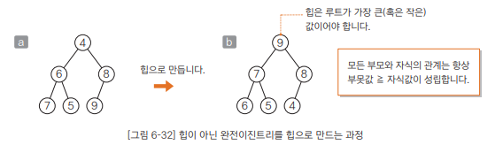
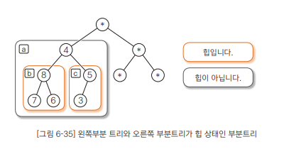

# Chapter06 정렬 알고리즘 - 07 힙 정렬
- 힙 정렬은 선택 정렬을 응용한 알고리즘으로 힙의 특성을 이용하여 정렬한다.

<br>

## 힙이란?
- 힙 정렬(heap sort)는 힙(heap)을 사용하여 정렬하는 알고리즘
- 힙은 '부못값이 자식 값보다 항상 크다'라는 조건을 만족하는 완전이진트리
- 
  - a는 힙이 아닌 완전이진트리, a를 힙으로 만들면 b와 같은 상태가 됨
  - b에서 부모와 자식 관계는 항상 '부못값 ≧ 자식값'
  - 힙의 가장 위쪽에 있는 루트가 가장 큰 값

<br>

### 조금만 더! 트리에 대해 알고싶어요!
- 크리의 가장 윗부분은 루트(root)라고 함
- 요소의 상하 관계를 '부모(parent)'와 '자식(child)', 자식 간의 관계를 '형제(sibling)'라고 함
- 완전 이진 트리는 트리의 한 종류
- 완전 이진트리의 특징은 '완전 이진' 상태라는 것
  - 완전 : 부모는 자식을 왼쪽부터 추가하는 모양을 유지한다.
  - 이진 : 부모가 가질 수 있는 자식의 개수는 최대 2개이다.

<br>

- 힙에서 부모와 자식 간의 대소 관계는 일정하지만 형제 사이의 대소 관계는 일정하지 않다.
  - 힙은 이러한 특성이 있기 때문에 부분 순서 트리(partial ordered tree)라고도 함
- 힙의 요소를 배열에 저장하는 과정
  1. 먼저 가장 위쪽에 있는 루트(10)를 a[0]에 넣음
  2. 한 단계 아래로 내려가 각 요소를 왼쪽에서 오른쪽으로 따라감, 그 과정에서 인덱스 값을 1씩 늘리면서 배열의 각 요소에 힙의 요소를 대입
  - 이 과정을 거쳐 힙의 요소를 배열에 저장하면 부모와 자식의 인덱스 사이에 다음과 같은 관계가 성립
    ```
    - 부모는 a[(i-1)/2]
    - 왼쪽 자식은 a[i*2+1]
    - 오른쪽 자식은 a[i*2+2]
    ```

<br>

---

<br>

## 힙 정렬 알아보기
- 힙 정렬은 '가장 큰 값이 루트에 위치'하는 특징을 이용하는 정렬 알고리즘
- 구체적으로 보면 다음과 같은 작업을 반복
  ```
  - 힙에서 가장 큰 값인 루트를 꺼낸다.
  - 루트 이외의 부분은 힙으로 만든다.
  ```
  - 이 과정에서 꺼낸 값을 늘어놓으면 배열은 정렬을 마치게 된다.
- 즉, 힙 정렬은 선택 정렬을 응용한 알고리즘으로, 힙에서 가장 큰 값인 루트를 꺼낸 뒤 남은 요소에서 다시 가장 큰 값을 구해야 함

<br>

### 루트를 없애고 힙 상태 유지하기
- 루트를 없앤 다음 다시 힙을 만들기 위해 요소를 알맞는 위치로 내려보내는 절차를 정리하면 다음과 같다.
  ```
  1. 루트를 꺼낸다.
  2. 마지막 요소를 루트로 옮긴다.
  3. 자기보다 큰 값을 갖는 자식 요소와 자리를 바꾸며 아래 쪽으로 내려가는 작업을 반복한다.
     이때 자식 값이 작거나 잎에 다다르면 작업을 종료한다.
  ```

<br>

### 힙 정렬 알고리즘 살펴보기
- 루트를 배열 마지막 요소와 바꾸고 힙 상태 유지하기를 반복하면 배열의 마지막부터 큰 값이 차례대로 대입됨
- 위의 과정을 간단히 정리하면 다음과 같다.
  ```
  1. 변수 i 값은 n-1로 초기화합니다.
  2. a[0]과 a[i]를 바꿉니다.
  3. a[0], a[1], ... , a[i-1]를 힙으로 만듭니다.
  4. i 값을 1 감소시텨 0이 되면 끝냅니다. 그렇지 않으면 '2'로 돌아갑니다.
  ```
- 초기 상태의 배열이 힙 상태가 아닐 수 있기 때문에 이 과정을 적용하기 전에 배열을 힙 상태로 만들어야 함

<br>

---

<br>

## 배열을 힙으로 만들기
- 
  - 4를 루트로 하는 부분트리(a)는 힙이 아니다.
  - 그러나 왼쪽 자식 8을 루트로 하는 부분트리(b)와 오른쪽 자식 5를 루트로 하는 부분트리(c)는 모두 힙
  - 앞에서 루트를 없앤 다음 마지막 요소를 루트로 옮기고, 루트로 옮긴 요소를 알맞은 위치로 내려보내면서 힙을 만들었다.
  - 여기서도 이 방법으로 루트 4를 알맞은 위치로 내려보내면서 부분 트리 a를 힙으로 만들 수 있다.
  - 이 방법을 사용하면 아랫부분의 작은 부분 트리부터 시작해 올라가는 방식(bottom-up)으로 전체 배열을 힙으로 만들 수 있다.

<br>

### downHeap 메서드
- 배열 a에서 a[left]~a[right]의 요소를 힙으로 만드는 메서드
- 맨 앞에 있는 a[left] 이외에는 모두 힙 상태라고 가정하고 a[left]를 아랫부분의 알맞은 위치로 옮겨 힙 상태를 만든다.

<br>

### heapSort 메서드
- 요솟수 n개인 배열 a를 힙 정렬하는 메서드
- 다음과 같이 2단계로 구성
  ```
  [1] downHeap 메서드를 사용하여 배열 a를 힙으로 만듭니다.
  [2] 루트(a[0])에 있는 가장 큰 값을 커내 배열 마지막 요소와 바꾸고 배열의 나머지 부분은 다시 힙으로 만드는 과정을 반복하여 정렬을 수행합니다.
  ```

<br>

### 힙 정렬의 시간 복잡도
- 앞에서 설명한 대로 힙 정렬은 선택 정렬을 응용한 알고리즘
  - 단순 선택 정렬에서는 아직 정렬하지 않은 모든 요소를 대상으로 가장 큰 값을 선택
    - 시간 복잡도는 o(n)
  - 힙 정렬에서는 첫 요소를 꺼내는 것만으로 가장 큰 값을 구할 수 있지만 남은 요소를 '다시 힙으로 만들기'가 필요
    - '다시 힙으로 만들기' 작업을 수행하는 시간 복잡도는 O(log n)
  - 결국 '다시 힙으로 만들기' 작업을 반복하므로, 정렬 전체에 필요한 시간복잡도는 단순 선택 정렬이 O(n^2)인데 반해 힙 정렬은 O(n log n)이다.