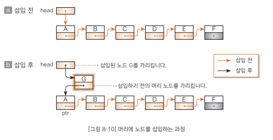

# Chapter08 리스트 - 2 포인터로 연결리스트 만들기
- 이번 절에서는 다음 노드를 가리키는 포인터를 각 노드에 포함시키는 연결리스트를 살펴보겠다.

<br>

## 포인터로 연결 리스트 만들기
- 리스트에 데이터를 삽입할 때 노드형 객체를 만들고 삭제할 때 노드용 객체를 없애면 배열로 리스트를 만들 때 발생하는 문제를 해결할 수 있다.
  - 이런 노드를 구현하는 것이 클래스 Node<E>이다.
    ```java
    class Node<E> {
      E data; // 데이터를 참조
      Node<E> next; // 다음 노드를 참조
    }
    ```
    - Node<E>는 데이터용 필드인 data와는 별도로 자기 자신과 같은 클래스형의 인스턴스를 참조하는 (가리키는) 참조형 필드 next를 가진다.
      - 이런 클래스 구조를 자기 참조형(self-referential)이라고 한다.
    - Node<E>는 제네릭으로 구현되므로 데이터형 E는 임의의 클래스형이 허용된다.
    - Node<E> 이미지는 좀 더 엄밀하게 나타내면 다음과 같다.
    - 
      - 필드 data의 자료형인 E가 참조형이므로 클래스형 변수 data가 나타내는 것이 데이터 그 자체가 아니라 데이터를 넣어두는 인스턴스에 대한 '참조'이기 때문
    - 다음 노드를 참조하는 next를 뒤쪽 포인터라고 부르겠다.
      - 뒤쪽 포인터 next에 넣어 두는 것을 다음 노드에 대한 참조
      - 다만 다음 노드가 없는 '꼬리 노드'의 뒤쪽 포인터 값은 널(null)을 참조하도록 함

<br>

---

<br>

## 노드 클래스 Node<E>
- 노드 클래스 Node<E>는 연결리스트 클래스 LinkedList<E> 안에 선언되어 있다.
- 이 클래스에는 다음과 같이 두 필드(data, next)와 생성자가 있다.
  > - data ... 데이터(데이터 참조 : 형은 E)를 나타낸다.
  > - next ... 뒤쪽 포인터(데이터 참조 : 형은 Node<E>)를 나타낸다.
  > - 생성자 ... Node<E> 의 생성자는 매개변수 data.next에 전달받은 값을 해당 필드에 대입한다.

<br>

### 연결 리스트 클래스 LinkedList<E>
- 클래스 LinkedList<E>에는 다음과 같이 두 필드가 있다.
  > - head ... 머리 노드를 가리킨다. 머리 포인터라고 부르겠다.
  > - crnt ... 현재 선택한 노드를 가리킨다. 리스트에서 노드를 '검색'하고 해당 노드를 선택한 뒤, 바로 그 노드를 '삭제'라는 등의 용도로 사용한다. 선택 포인터라고 부르겠다.
  - 
    - 연결리스트 클래스의 이미지를 나타낸다.
    - 리스트에 있는 각 노드는 Node<E>형이다.
    - 연결 리스트 클래스가 갖는 데이터는 실질적으로 머리 포인터 head 뿐이다.

<br>

### 생성자 LinkedList
- 연결리스트 클래스 LinkedList<E>의 생성자는 노드가 하나도 없는 비어 있는 연결 리스트를 생성
- 이 생성자는 머리포인터 head에 null을 대입
  - Node<E>형의 변수 head가 머리 노드에 대한 참조이지 머리 노드 그 자체가 아님에 주의해야 함
- 비어 있는 연결리스트는 노드도 없고 head가 가리키는 곳도 없으므로(가리킬 노드가 없으므로) 그 값을 null로 함
- 그리고 crnt에도 null을 넣어 어떤 요소도 선택하지 않도록 함


- 노드 개수에 따라 연결 리스트를 판단하는 방법
  1. 연결리스트가 비어 있는지 판단하는 방법
    - [a]는 노드가 하나도 없는 상태이다.(빈 연결 리스트)
    - 이때 리스트가 비어 있는지 판단하는 방법은 다음과 같다.
      ```
      head == null // 연결리스트가 비어 있는지 확인
      ```
  2. 노드가 1개인 연결 리스트를 판단하는 방법
    - [b]는 연결 리스트에 노드가 1개만 있는 상태
    - 머리 포인터 head가 가리키는 곳은 머리 노드 A
    - 머리 노드 A는 리스트의 꼬리 노드이기도 하므로 그 뒤쪽 포인터 값을 null
    - head가 가리키는 노드가 갖고 있는 뒤쪽 포인터 값이 null이므로 연결 리스트의 노드가 1개뿐인지 판단하는 방법은 다음과 같다.
      ```
      head.next == null // 노드가 1개인지 확인
      ```
  3. 노드가 2개인 연결 리스트를 판단하는 방법
    - [c]는 노드가 2개 있는 상태, 머리 노드는 A, 꼬리 노드는 B
    - 이때 head가 가리키는 노드 A의 next는 노드 B를 가리킨다.
    - 꼬리 노드 B의 next는 null 값을 가지고 있기 때문에 연결 리스트의 노드가 2개읹 판단하는 방법은 다음과 같다.
      ```
      head.next.next == null // 노드가 2개인지 확인
      ```
      - 노드 A의 데이터는 head.data이고 노드 B의 데이터는 head.next.data
  4. 꼬리 노드인지 판단하는 방법
    - Node<E> 형의 변수 p가 리스트의 노드 중 하나를 가리킬 때 변수 p가 가리키는 노드가 연결 리스트의 꼬리 노드인지 판단하는 방법은 다음과 같다.
      ```
      p.next == null // p가 가리키는 노드가 꼬리 노드인지 확인
      ```
      
<br>

### 검색을 수행하는 메서드 search
- search 메서드는 주어진 조건을 만족하는 노드를 검색
- 검색에서 사용하는 알고리즘은 선형 검색이고 검색하는 노드를 만날 때까지 머리 노드부터 순서대로 스캔한다.
- 노드 스캔은 다음 조건 중 어느 하나가 성립하면 종료한다.
  > 종료조건 1. 검색 조건을 만족하는 노드를 찾지 못하고 꼬리 노드를 지나가기 직전인 경우
  > 종료조건 2. 검색 조건을 만족하는 노드를 찾은 경우
- 이 메서드가 전달받는 매개변수는 다음과 같다.
    > - 첫 번째 매개변수 obj ... 검색할 때 키가 되는 데이터를 넣어둔 객체
    > - 두 번째 매개변수 c ... 첫 번째 매개변수와 연결 리스트의 개별 노드 안에 있는 데이터를 비교하기 위한 comparator c로 obj와 선택한 노드의 데이터를 비교하여 그 결과가 0이면 검색 조건이 성립한 것으로 봄

<br>

### 머리에 노드를 삽입하는 메서드 addFirst
- addFirst 메서드는 리스트의 머리에 노드를 삽입한다.



- 처리 과정은 다음과 같다.
  1. 머리 노드 A를 가리키는 머리 포인터를 ptr에 대입
  2. 삽입할 G를 new Node<E>(obj, ptr)로 생성
    - 모드 G의 데이터는 obj가 되고 뒤쪽 포인터가 가리키는 곳은 ptr(삽입 전의 머리 노드 A)이 됨
    - 생성한 노드를 참조하도록 head를 업데이트

<br>

### 꼬리에 노드를 삽입하는 메서드 addLast
- addLast 메서드는 리스트 꼬리에 노드를 삽입
- 리스트가 비어있는지 아닌지(head == null) 먼저 확인하고 경우에 따라 다음과 같이 처리한다.
  > - 리스트가 비어 있는 경우
  >   : 리스트 머리에 노드를 삽입, 따라서 addFirst 메서드로 처리
  > - 리스트가 비어 있지 않은 경우
  >   : 리스트 꼬리에 노드 G를 삽입

<br>

### 머리 노드를 삭제하는 메서드 removeFirst
- removeFirst 메서드는 머리 노드를 삭제함
- 리스트가 비어 있지 않을(head != null) 떄만 삭제를 실행
- 머리 노드에 대한 참조 head에 두 번째 노드 B에 대한 참조 head.next를 대입하여 head가 가리키는 노드를 B로 업데이트
- 리스트에 노드가 1개만 있는 경우에도 오류 없이 삭제할 수 있다.
  - 이 경우 삭제하기 전의 머리 노드는 꼬리 노드이기 때문에 다음 노드를 가리키는 head.next의 값은 null
  - 이 null을 head에 대입하면 리스트는 빈 상태가 됨

<br>

### 꼬리 노드를 삭제하는 메서드 removeLast
- removeLast 메서드는 꼬리 노드를 삭제
- 리스트에 노드가 몇 개 있는지에 따라 다음과 같이 처리한다.
  > - 리스트에 노드가 1개만 있는 경우
  >   : 머리 노드를 삭제합니다. 따라서 removeFirst 메서드로 처리합니다.
  > - 리스트에 노드가 2개 이상 있는 경우
  >   : 리스트에서 꼬리 노드 F를 삭제합니다.

<br>

### 선택한 노드를 삭제하는 메서드 remove
- remove 메서드는 임의의 노드를 삭제한다.
- 선택한 노드가 머리 노드인지 아닌지에 따라 다음과 같이 처리한다.
  > - p가 머리 노드인 경우
  >   : 머리 노드를 삭제하면 된다. 따라 removeFirst 메서드로 처리한다.
  > - p가 머리 노드가 아닌 경우
  >   : 연결 리스트에서 p가 참조하는 노드 D를 삭제한다.

<br>

### 선택한 노드를 삭제하는 메서드 removeCurrentNode
- 현재 선택한 노드를 삭제하는 메서드
- remove 메서드에 선택 포인터 crnt를 건네주고 처리를 맡긴다.

<br>

### 모든 노드를 삭제하는 메서드 clear
- 모든 노드를 삭제하는 메서드
- 연결 리스트가 비어있는 상태(head == null)가 될 때까지 반복해서 머리 요소를 삭제하여 모든 노드를 삭제

<br>

### 선택 노드를 하나 뒤쪽으로 진행시키는 메서드 next
- 선택 노드를 하나 뒤쪽으로 나아가도록 하는 메서드
- 리스트가 비어 있지 않고, 선택 노드의 뒤쪽 노드가 있을 때만 선택 노드를 하나 뒤쪽으로 진행시킴
- 선택 노드가 나아가면 true를, 그렇지 않으면 false를 반환

<br>

### 선택 노드를 출력하는 메서드 printCurrentNode
- 선택 노드를 출력하는 메서드
- crnt가 참조하는 노드의 데이터가 crnt.data에 대해 묵시적으로 문자열로 반환하여, 곧 toString 메서드를 호출하여 그 결과로 얻어지는 문자열을 보여 줌
- 다만 선택 노드가 없는 경우(crnt == null) '선택한 노드가 없습니다.'라고 출력

<br>

### 모든 노드를 출력하는 메서드 dump
- 리스트의 순서대로 모든 노드를 출력
- 머리 노드부터 꼬리 노드까지 스캔하면서 각 노드의 데이터 ptr.data를 출력
- 이 메서드는 선택 포인터 crnt 값을 업데이트하지 않는다.

<br>

- 아래는 각 메서드를 실행한 후의 선택 포인터 crnt 값
<table>
  <tr>
    <td>생성자</td>
    <td>null</td>
  </tr>
  <tr>
    <td>search</td>
    <td>검색에 성공하면 찾은 노드</td>
  </tr>
  <tr>
    <td>addFirst</td>
    <td>삽입할 머리 노드</td>
  </tr>
  <tr>
    <td>addLast</td>
    <td>삽입할 꼬리 노드</td>
  </tr>
  <tr>
    <td>removeFirst</td>
    <td>삭제한 후 머리 노드(리스트가 비어있으면 null)</td>
  </tr>
  <tr>
    <td>removeLast</td>
    <td>삭제한 후 꼬리 노드(리스트가 비어있으면 null)</td>
  </tr>
  <tr>
    <td>remove</td>
    <td>삭제한 노드 바로 앞 노드</td>
  </tr>
  <tr>
    <td>removeCurrentNode</td>
    <td>null</td>
  </tr>
  <tr>
    <td>clear</td>
    <td>null</td>
  </tr>
  <tr>
    <td>next</td>
    <td>진행한 후 선택 노드</td>
  </tr>
  <tr>
    <td>printCurrentNode</td>
    <td>업데이트하지 않음</td>
  </tr>
  <tr>
    <td>dump</td>
    <td>업데이트하지 않음</td>
  </tr>
</table>

<br>

### 보충수업 8-1 toString 메서드
- 연결리스트를 테스트하는 실습 8-2 프로그램에서는 toString 메서드를 Data 클래스 안에서 다음과 같이 정의함
  ```java
  public String toString() {/* ... */}
  ```
  - toString 메서드는 클래스 인스턴스의 상태(데이터 내용)를 간결하게 표현하는 문자열을 만들어 반환
  - 이 메서드를 클래스 안에서 정의하는 것은 프로그램 작성의 기본 원칙
- 원래 toString은 java.lang 패키지의 Object 클래스 안에 다음과 같이 정의된 메서드
  - 이 메서드는 "클래스 이름@해시값"의 형태로 문자열을 반환
  ```java
  public class Object {
    // 생략
    public String toString() {
      return getClass().getName() + "@" + Integer.toHexString(hashCode());
    }
    // 생략
  }
  ```
- 자바의 모든 클래스는 직접적이든 간접적이든 Object 클래스에서 파생됨
- 클래스에서 toString 메서드를 정의한다는 것은 Object 클래스의 toString 메서드를 오버라이드하는 것(상위 클래스에서 상속받은 메서드를 다시 새롭게 재정의하는 것)을 의미
- 자바에서 메서드를 오버라이드할 때 접근 제한을 강화하는 것은 불가능
  - 어떤 클래스라도 toString 메서드는 public으로 정의해야 함
- toString 메서드를 오버라이드할 때는 클래스의 특성이나 인스턴스의 상태를 나타내는 알맞은 문자열을 반환하도록 정의
- toStringTester 클래스
  - '문자열을 출력하는 함수에 클래스형 변수를 넣으면 자동으로 toString을 명시하지 않아도 toString 메서드를 호출한다'라는 규칙이 있다.
  - toString 메서드를 간단히 정리하면 다음과 같은 기본원칙이 있음을 알 수 있다.
    > 인스턴스의 상태를 간단한 문자열로 반환하는 메서드를 public String toString() 형식으로 정의합니다. 이렇게하면 인스턴스의 상태를 출력할 때 인스턴스를 출력하는 코드에서 toString 메서드를 자동으로 호출합니다.
    
<br>

---

<br>

정리한 내용에 대한 저작권은 "[do it! 자료구조와 함께 배우는 알고리즘 입문 자바편 개정](https://www.aladin.co.kr/search/wsearchresult.aspx?SearchTarget=All&SearchWord=Do+it%21+%EC%9E%90%EB%A3%8C%EA%B5%AC%EC%A1%B0%EC%99%80+%ED%95%A8%EA%BB%98+%EB%B0%B0%EC%9A%B0%EB%8A%94+%EC%95%8C%EA%B3%A0%EB%A6%AC%EC%A6%98+%EC%9E%85%EB%AC%B8+%3A+%EC%9E%90%EB%B0%94+%ED%8E%B8)"에 있습니다.