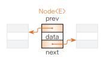

# Chapter08 리스트 - 04 원형 이중 연결 리스트 만들기
- 이번에는 08-3에서 학습한 연결리스트보다 더 복잡한 구조를 갖는 원형 이중 연결 리스트를 살펴보겠다.

<br>

## 원형 리스트 살펴보기
- 꼬리 노드가 머리 노드를 가리키는 연결 리스트를 원형리스트(circular list)라고 함
- 원형 리스트는 고리 모양으로 나열된 데이터를 저장할 때 알맞는 자료 구조
- 보통 연결 리스트와 다른 점은 꼬리 노드의 다음 노드를 가리키는 포인터가 널(null)이 아니라 머리 노드의 포인터라는 점
- 개별 노드의 자료형은 보통 연결리스트와 같다.

<br>

---

<br>

## 이중 연결 리스트 살펴보기
- 연결리스트의 가장 큰 단점은 다음 리스트는 찾기 쉽지만 앞쪽 노드는 찾기 어렵다는 점
  - 이런 단점을 개선한 자료구조가 이중 연결 리스트(doubly linked list)
- 각 노드에는 다음 노드에 대한 포인터와 앞쪽 노드에 대한 포인터가 주어진다.
- 이중 연결 리스트의 노드는 3개의 필드가 있는 클래스 Node<E>로 구현할 수 있다.
  ```java
  class Node<E> {
    E data; //데이터
    Node<E> prev; // 앞쪽 노드를 가리킴
    Node<E> next; // 뒤쪽 노드를 가리킴
  }
  ```

  

  > - data ... 데이터(데이터 참조 : 형(Type)은 E)
  > - prev ... 앞쪽 포인터(앞쪽 노드 참조 : 형(Type)은 Node<E>)
  > - next ... 뒤쪽 포인터(뒤쪽 노드 참조 : 형(Type)은 Node<E>)

<br>

---

<br>

## 원형 이중 연결 리스트 만들기
- 원형리스트와 이중 연결 리스트를 조합한 원형 이중 연결 리스트(circular doubly linked list)를 알아보겠다.

<br>

### 노드 클래스 Node<E>
- 노드 클래스는 리스트 클래스 안에서 선언
- 노드 클래스 Node<E>에는 3개의 필드(data, prev, next) 외에 다음과 같은 2개의 생성자
  > [1] Node() 
  > - 데이터 data가 null이고 앞쪽 포인터와 뒤쪽 포인터가 모두 this인 노드를 생성합니다. 자기 자신의 노드가 앞쪽 노드이면서 동시에 다음 노드가 됩니다.
  > 
  > [2] Node(E obj, Node<E> prev, Node<E> next)
  > - 데이터 data가 obj이고 앞쪽 포인터가 prev, 뒤쪽 포인터가 next인 노드를 생성합니다.

<br>

### 원형 이중 연결 리스트 클래스 DoubleLinkedList<E>
- 원형 이중 연결 리스트를 나타내는 클래스
- 연결리스트 클래스 LinkedList<E>와 마찬가지로 2개의 필드를 갖는다.
  > - head ... 머리 포인터(머리 노드 참조 : 자료형은 Node<E>)
  > - crnt ... 선택 포인터(선택 노드 참조 : 자료형은 Node<E>)

<br>

### 생성자 DoubleLinkedList 메서드
- 생성자는 비어 있는 원형 이중 연결 리스트를 생성
- 이때 데이터를 갖지 않는 노드를 1개만 만든다.
  - 이 노드는 노드의 삽입과 삭제를 원활하게 처리하기 위해 리스트의 머리에 계속 존재하는 더미 노드이다.

<br>

### 리스트가 비어있는가를 조사하는 메서드 isEmpty
- 리스트가 비어있는가(더미 노드만 있는가)를 조사하는 메서드
- 더미 노드의 뒤쪽 포인터 head.next가 더미 노드인 head를 가리키고 있으면 리스트는 비어 있는 것
- 리스트가 비어있으면 true를 그렇지 않으면 false를 반환

<br>

### 노드를 검색하는 메서드 search
- 노드를 선형 검색하는 메서드
- 머리 노드부터 시작하여 뒤쪽 포인터를 차례로 따라가며 스캔하는 과정은 연결 리스트 클래스 LinkedList<E>의 search 메서드와 거의 같다.
- 다만 실제 머리 노드가 더미 노드의 다음 노드이므로 검색을 시작하는 곳이 다르다.
  - 이 더미 노드의 뒤쪽 포인터가 가리키는 노드가 진짜 머리 노드
- while 문으로 스탠하는 과정에서 comparator c의 compare 메서드로 비교한 결과가 0이면 검색 성공
  - pre이 가리키는 노드의 데이터 data를 반환
  - 이때 선택 포인터 crnt가 찾는 노드 ptr을 가리키도록 업데이트
- 원하는 노드를 찾지 못하고 스캔이 한 바퀴 돌아 다시 머리 노드로 돌아올 때 (ptr이 head가 되었을 때) while문이 끝남
  - 검색에 실패했으므로 null을 반환
  - ptr이 선택하고 있는 것이 마지막 노드일 때 뒤쪽 포인터가 가리키는 노드는 더미 노드가 됨
  - 따라서 ptr이 가리키는 곳이 head와 같아지고 여기서 스캔이 끝남

<br>

### 조금만 더! 원형 이중 연결 리스트에서 p가 기리키는 노드의 위치를 판단하는 방법
- 원형 이중 연결 리스트에서 Node<E>형의 변수 p가 리스트의 어떤 노드를 가리킬 때, p가 가리키는 노드의 위치는 다음 식을 사용하여 판단
  ```
  p.prev == head // p가 가리키는 노드가 실질적인 머리 노드인지 확인
  p.prev.prev == head // p가 가리키는 노드가 실절적인 머리 노드에서부터 2번째 노드인지 확인
  p.next == head // p가 가리키는 노드가 꼬리 노드인지 확인
  p.next.next == head // p가 가리키는 노드가 꼬리 노드에서부터 2번째 노드인지 확인
  ```
  
<br>

### 선택 노드를 출력하는 메서드 printCurrentNode
- 선택 노드를 출력하는 메서드로, 선택 노드의 데이터 crnt.data를 출력
- 리스트가 비어 이쓰면 '선택 노드가 없습니다.'라고 출력

<br>

### 모든 노드를 출력하는 메서드 dump
- 리스트에 있는 모든 노드를 머리부터 꼬리까지 순서대로 출력하는 메서드
- head.next부터 스탠을 시작하여 뒤쪽 포인터를 따라가면서 각 노드의 데이터를 출력
- 한바퀴 돌아 head로 돌아오면 스캔을 끝냄

<br>

### 모든 노드를 거꾸로 출력하는 메서드 dumpReverse
- 리스트의 모든 노드를 꼬리부터 머리까지 거꾸로 출력하는 메서드
- head.prev부터 스캔을 시작하여 앞쪽 포인터를 따라가면서 각 노드의 데이터를 출력
- 한 바퀴 돌아 head로 돌아오면 스캔을 끝냄

<br>

### 선택 노드를 뒤쪽으로 진행하는 메서드 next
- 선택 노드를 하나 뒤쪽의 노드로 나아가도록 하는 메서드
- 리스트가 비어 있지 않고 선택 노드에 다음 노드가 있을 떄만 선택 노드가 진행함

<br>

### 선택 노드를 앞쪽으로 진행하는 메서드 prev
- 선택 노드를 하나 앞쪽의 노드로 나아가도록 하는 메서드
- 리스트가 비어있지 않고 선택 노드에 다음 노드가 있을 때만 선택 노드가 진행함

<br>

### 노드를 삽입하는 메서드 add
- 선택 노드의 바로 뒤에 노드를 삽입하는 메서드로, 다른 메서드의 요청을 받아 삽을을 대신 처리하기도 한다.
- 앞에서 다뤘던 연결 리스트 프로그램과 달리 리스트의 맨 앞에 항상 더미 노드가 있으므로 비어있는 리스트에 삽입하거나 리스트 맨 앞에 삽입하는 것을 큭별히 다룰 필요가 없다.

<br>

### 머리에 노드를 삽입하는 메서드 addFirst
- 리스트의 머리에 노드를 삽입하는 메서드
- 더미 노드의 바로 뒤에 노드를 삽입하므로 선택 포인터 crnt가 가리키는 곳은 head로 업데이트한 후에 add 메서드를 호출

<br>

### 꼬리에 노드를 삽입하는 addLast
- 리스트의 꼬리에 노드를 삽입하는 메서드
- 꼬리 노드 바로 뒤에 있는 더미 노드의 바로 앞에 노드에 삽입하므로 선택 포인터 crnt가 가리키는 곳을 head.prev로 업데이트한 후에 add 메서드로 호출

<br>

### 선택 노드를 삭제하는 메서드 removeCurrentNode
- 선택 노드를 삭제하는 메서드로, 다른 삭제 관련 메서드가 삭제를 요청하면 대신 처리하기도 한다.
- 더미 노드는 삭제할 수 없으므로 먼저 리스트가 비어 있는지 확인하고 리스트가 비어 있지 않을 때만 삭제한다.

<br>

### 임의의 노드를 삭제하는 메서드 remove
- p가 참조하는 노드를 삭제하는 메서드
- 삭제는 리스트가 비어 있지 않고 인수가 가리키는 노드 p가 있을 때만 처리
- while문은 모든 노드를 스캔하는 과정에서 노드 p를 찾으면 crnt가 가리키는 곳을 p로 업데이트하고 removeCurrentNode 메서드를 호출

<br>

### 머리 노드를 삭제하는 메서드 removeFirst
- 머리 노드를 삭제하는 메서드
- 선택 포인터 crnt가 가리키는 곳을 실절적인 머리 노드 head.next로 업데이트하고 removeCurrentNode 메서드를 호출

<br>

### 꼬리 노드를 삭제하는 메서드 removeLast
- 꼬리 노드를 삭제하는 메서드
- 선택 포인터 crnt가 가리키는 곳을 꼬리 노드 head.prev로 업데이트하고 removeCurrentNode 메서드를 호출

<br>

### 모든 노드를 삭제하는 메서드 clear
- 더미 노드를 제외한 모든 노드를 삭제하는 메서드
- removeFirst로 리스트가 텅 빌 때까지 반복하여 머리 노드를 삭제
- 그 결과 선택 포인터 crnt가 가리키는 곳은 더미노드 head로 업데이트

<br>

---

<br>

정리한 내용에 대한 저작권은 "[do it! 자료구조와 함께 배우는 알고리즘 입문 자바편 개정](https://www.aladin.co.kr/search/wsearchresult.aspx?SearchTarget=All&SearchWord=Do+it%21+%EC%9E%90%EB%A3%8C%EA%B5%AC%EC%A1%B0%EC%99%80+%ED%95%A8%EA%BB%98+%EB%B0%B0%EC%9A%B0%EB%8A%94+%EC%95%8C%EA%B3%A0%EB%A6%AC%EC%A6%98+%EC%9E%85%EB%AC%B8+%3A+%EC%9E%90%EB%B0%94+%ED%8E%B8)"에 있습니다.