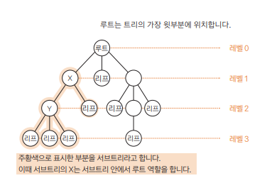
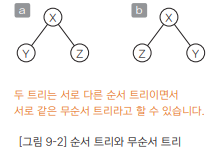
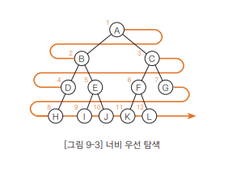
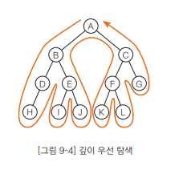
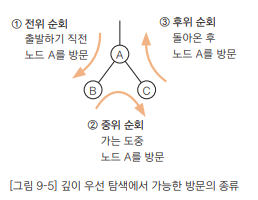

# Chapter 09 트리 - 01 트리
- 이 장에서는 데이터 사이의 계층관계를 나타내는 자료구조의 트리를 살펴보겠다.

## 트리란?
- 트리(tree)와 트리 관련 용어를 살펴보겠다.
  - 트리를 구성하는 요소는 노드(node)와 가지(edge)
  - 각각의 노드는 가지로 연결되어 있다.
  - ◯는 노드, —는 가지를 나타냄

 

### 루트
- 트리의 가장 윗 부분에 위치하는 노드를 루트(root)라고 함
- 하나의 트리에는 하나의 루트만 있다
- 그림을 거꾸로 보면 나무 모양과 비슷하다는 것을 알 수 있다.

 

### 리프
- 트리의 가장 아랫부분에 위치하는 노드를 리프(leaf)라고 함
- '가장 아래에 위치한다'라는 말은 물리적으로 가장 아랫부분에 위치한다는 의미가 아니라 노드가 더 이상 뻗어 나가지 않는 마지막에 위치한다는 의미
- 리프를 끝 노드(terminal node) 또는 바깥 노드(external node)라고도 함

 

### 안쪽 노드
- 리프를 제외한 나머지 노드(루트 포함)를 안쪽 노드라고 함
- 안쪽 노드를 끝이 아닌 노드(non-terminal node)라고도 함

 

### 자식
- 어떤 노드에서 가지로 연결된 아래쪽 노드를 자식(child)이라고 함
- 노드는 자식을 여럿 가질 수 있음
- 앞의 그림에서 X는 자식을 둘, Y는 셋을 가지고 있다.
- 리프는 자식을 가질 수 없음

 

### 부모
- 어떤 노드에서 가지로 연결된 바로 위쪽 노드를 부모(parent)라고 함
- 각 노드에서 부모는 하나뿐
- 앞의 그림에서 Y의 부모는 X
- 루트는 부모를 가질 수 없다.

 

### 형제
- 부모가 같은 노드를 형제(sibling)라고 함

 

### 조상
- 어떤 노드에서 위쪽으로 뻗어 나간 모든 노드를 조상(ancestor)이라고 함

 

### 자손
- 어떤 노드에서 아래쪽으로 뻗어 나간 모든 노드를 자손(descendant)이라고 함

 

### 레벨
- 루트로부터 얼마나 떨어져 있는지를 나타낸 값을 레벨(level)이라고 함
- 루트의 레벨은 0이고, 루트에서 가지가 하나씩 아래로 뻗어나갈 때마다 레벨이 1씩 늘어남

 

### 차수
- 노드가 갖는 자식의 수를 차수(degree)라고 함
  - 예를 들어 x의 차수는 2, y의 차수는 3
- 모든 노드의 하수가 n 이하인 트리를 n진 트리
- 앞의 그림의 트리는 모든 노드의 자식이 3개 이하이므로 3진 트리

 

### 높이
- 루트에서 가장 멀리 떨어진 리프까지의 거리(리프 레벨의 최댓값)을 높이(height)라고 함
- 그림에서 트리의 높이는 3

 

### 서브트리
- 트리 안에서 다시 어떤 노드를 정하고 그 자손으로 이루어진 트리를 서브트리(subtree)라고 함
- 그림에서 주황색으로 표시한 부분은 x를 루트로 하는 서브트리

 

### 널 트리
- 노드가 전혀 없는 트리를 널 트리(null tree)라고 함

 

---

 

## 순서 트리와 무순서 트리 살펴보기
- 형제 노드 사이의 순서 관계를 따지는지 그렇지 않은지에 따라 트리를 두 종류로 분류
  - 형제 노드의 순서를 따지면 순서 트리(ordered tree)
  - 따지지 않으면 무순서 트리(unordered tree)라고 함

- 예를 들어 그림의 a, b는 순서 트리로 보면 다른 트리지만 무순서 트리로 보면 같은 트리라고 할 수 있다.

 

---

 

## 순서 트리 탐색 살펴보기
- 순서 트리의 노드를 스캔하는 방법은 2가지
- 여기서는 이진 트리를 예로 들어 살펴보겠다.

 

### 너비 우선 탐색(가로형 탐색)
- 너비 우선 탐색(breadth-first search)은 낮은 레벨에서 시작해 왼쪽에서 오른쪽 방향으로 따라 가다가 한 레벨에서 탐색이 끝나면 다음 레벨로 내려감

- 탐색 순서는 다음과 같다.
  > A -> B -> C -> D -> E -> F -> G -> H -> I -> J -> K -> L

 

### 깊이 우선 탐색(세로형 탐색)
- 깊이 우선 탐색(depth-first search)은 리프에 이를 때까지 아래로 내려가면서 탐색
- 리프에 도달해 더 이상 탐색할 곳이 없으면 부모에게 돌아간다.
- 그런 다음 다시 자식 노드로 내려감

- 위의 그림은 노드 A를 몇 번 지나갔는지를 내타낸 것으로, 깊이 우선 탐색을 진행하면 다음과 같이 노드 A를 3회 지나갔음을 알 수 있다.
  > 1. A에서 B로 내려가지 직전에
  > 2. B에서 C로 지나가는 도중에
  > 3. C에서 A로 돌아온 후에
  - 다른 노드의 경우도 마찬가지이다.
    - 두 자식 가운데 한쪽(또는 양쪽)이 없으면 노드를 지나는 횟수가 줄겠지만 노드를 지나는 최댓값은 3회
    - 그런데 깊이 우선 탐색을 진행하면서 '언제 노드를 방문할지'는 위와 같이 세 종류로 구분
- 전위 순회(preorder)
  - 다음과 같은 순서로 깊이 우선 탐색을 진행
    > 노드 방문 -> 왼쪽 자식 -> 오른쪽 자식
  - 이처럼 전위 순회로 깊이 우선 탐색을 진행하면 다음 순서로 방문
    > A -> B -> D -> H -> I -> J -> C -> F -> K -> L -> G
- 중위 순회(inorder)
  - 다은과 같은 순서로 깊이 우선 탐색을 진행
    > 왼쪽 자식 -> 노드 방문 -> 오른쪽 자식
  - 이처럼 중위 순회로 깊이 우선 탐색을 진행하면 다음 순서로 방문
    > H -> D -> B -> I -> E -> J -> A -> K -> F -> L -> C -> G
- 후위 순회(postorder)
  - 다음과 같은 순서로 깊이 우선 탐색을 진행
    > 왼쪽 자식 -> 오른쪽 자식 -> (돌아와) 노드 방문
  - 이처럼 후위 순회로 깊이 우선 탐색을 진행하면 다음 순서로 방문
    > H -> D -> I -> J -> E -> B -> K -> L -> F -> G -> C -> A
  