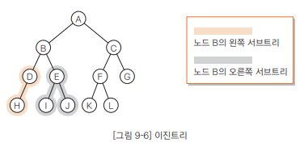
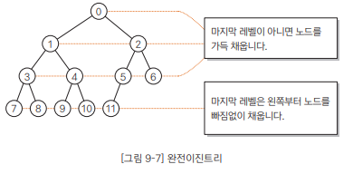
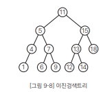
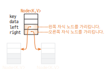
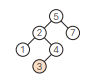
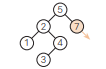
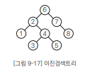
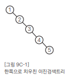

# Chapter09 트리 - 02 이진트리와 이진검색트리
- 이번 절에서는 단순하면서도 실제 업무 프로그램에서 자주 사용하는 이진트리와 이진검색트리를 살펴보곘다.

<br>

## 이진트리란?
- 각 노드가 왼쪽 자식과 오른쪽 자식 둘을 갖는 트리를 이진트리(binary tree)라고 함
- 이때 두 자식 가운데 한쪽이 없거나 둘다 없는 노드가 포함되어도 됨



- 이진 트리의 특징은 왼쪽 자신과 오른쪽 자식을 구분한다는 점ㅁ
- 그럼에서 노드 B의 왼쪽 자식은 D, 오른쪽 자식은 E
  - 이때 왼쪽 자식을 루트로하는 서브트리를 왼쪽 서브트리(left subtree), 오른쪽 자식을 루트로 하는 서브트리를 오른쪽 서브트리(right subtree)라고 함

<br>

---

<br>

## 완전 이진 트리란?
- 루트에서 아래쪽 레벨로 내려가는 노드가 빠짐없이 채워져 있고, 또 같은 레벨에서는 왼쪽에서 오른쪽으로 노드가 빠짐없이 채워져 있는 이진트리를 완전이진트리(complete binary tree)라고 함
  > 1. 마지막 레벨을 제외한 레벨은 노드를 빠짐없이 가득 채웁니다.
  > 2. 마지막 레벨은 왼쪽부터 오른쪽 방향으로 노드를 빠짐없이 채우되 반드시 끝까지 채울 필요는 없습니다.
- 높이가 K인 완전이진트리가 가질 수 있는 노드의 최댓값은 2^(k+1) - 1개
- 따라서 n개의 노드를 저장할 수 있는 완전이진트리의 높이는 log n



- 완전이진 트리에서 너비우선 탐색을 하며 가 노드에 0, 1, 2, ... 값을 주면 배열에 저장하는 인덱스와 일대일 대응한다는 것을 알 수 있다.

<br>

---

<br>

## 이진검색트리 살펴보기
- 이진 검색 트리(binary search tree)는 이진 트리가 다음 조건을 만족하면 됨
  > 1. 어떤 노드 N을 기준으로 왼쪽 서브 트리 노드의 모든 키값은 노드 N의 키값보다 작다.
  > 2. 오른쪽 서브 트리 노드의 키 값은 노드 N의 키값보다 크다
  - 그러므로 같은 키 값을 갖는 노드는 없다.



- 여기서 노드 5를 보면 왼쪽 서브 트리(4, 1)은 모두 5보다 작다
- 그리고 오른쪽 서브 트리(7, 6, 9)는 모두 5보다 크다
- 이때 이진 검색트리를 중위 순환하면 다음과 같이 키값의 오름차순으로 노드를 얻을 수 있다.
  > 1 -> 4 -> 5 -> 6 -> 7 -> 9 -> 11 -> 12 -> 13 -> 14 -> 15 -> 18
- 이진 검색 트리는 다음과 같은 특징 때문에 폭 넓게 사용됨
  > - 구조가 단순하다
  > - 중위 순회를 하면 키값의 오름차순으로 노드를 얻을 수 있다.
  > - 이진 검색과 비슷한 방식으로 아주 빠르게 검색할 수 있다.
  > - 노드를 삽입하는 것이 쉽다.

<br>

---

<br>

## 이진 검색 트리 만들기
- 이진 검색 트리 프로그램을 구현해 보겠다.

<br>

### 노드 클래스 Node<K, V>
- 이진 검색 트리의 개별 노드를 나타내는 노드 클래스 Node<K, V>(클래스 BinTree<K, V>에 정의되어 있음)는 다음과 같이 필드 4개로 구성됨
  > - key ... 키값(자료형 K는 임의의 자료형)
  > - data ... 데이터(자료형 V는 임의의 자료형)
  > - left ... 왼쪽 포인터(왼쪽 자식 노드를 가르킴, 형은 Node<K, V>)
  > - right ... 오른쪽 포인터(오른쪽 자식 노드를 가르킴, 형은 Node<K, V>)
- 다음은 노드의 이미지를 나타낸 것
  ```java
  class Node<K, V> {
    K key; // 키값
    V data; // 데이터
    Node<K, V> left; // 왼쪽 데이터
    Node<K, V> right; // 오른쪽 데이터
  }
  ```
  
  

- 노드 클래스 Node<K, V>에는 1개의 생성자와 3개의 메서드가 있다.
  > - 생성자 ... 각 필드에 넣어 둘 4개의 값을 전달받아 그대로 설정한다.
  > - getKey() ... 키값 key를 그대로 반환하는 메서드
  > - getValue() ... 데이터 data를 그대로 반환하는 메서드
  > - print() ... 데이터를 출력하는 메서드, 출력하는 것은 data, 즉 data에 대해 묵시적으로 toString 메서드를 호출하여 얻어지는 문자열

<br>

### 이진 검색 트리 클래스 BinTree<K, V>
- 이진 검색 트리 클래스 BinTree<K, V>는 2개의 필드로 구성됨
  > - root ... 루트에 대한 참조를 넣어 두는 필드
  > - comparator ... 키 값의 대소 관계를 판단하는 비교자, 이진 검색트리를 생성하는 생성자에서 비교자는 명시적으로 설정하지 않으면 자동으로 null이 되도록 초기자 null을 주어 선언

<br>

### 생성자
- 클래스 BinTree<K, V>에는 2개의 생성자가 있다.
- 둘 다 비어있는 이진 검색 트리를 생성함

[A] BinTree()
- 루트에 대한  참조인 root를 null로 하여 노드가 하나도 없는 (비어있는) 이진 검색 트리를 생성하는 생성자
- 이 생성자로 생성한 이진 검색 트리에서는 노드 키값의 대소 관계를 판단할 때 자연 순서에 따라 수행
- 따라서 키를 나타내는 K의 형(type)이 Comparable 인터페이스를 구현하고 있는 Integer 클래스나 String 클래스 등에 알맞다.
- 또 다른 생성자 [B]와 달리 비교자를 따로 설정하지 않으므로 비교자용 피드 Comparator의 값은 null이 된다.

[B] BinTree(Comparator<? super K> c)
- 인수로 비교자를 전달하는 생성자
- 이 생성자로 생성한 이진검색 트리에서는 키 값의 대소 관계를 판단할 때 전달받은 비교자에 의해 다음과 같이 수행함
  > 1. this()에 의해 인수를 전달받지 않는 생성자 BinTree()를 호출, root가 null인(비어 있는) 이진 검색 트리를 생성한다
  > 2. 필드 Comparator에 전달받은 c를 설정한다.

<br>

### 두 키값을 비교하는 메서드 comp
- 2개의 키 값을 비교하는 메서드
- 검색, 삽입, 삭제의 각 메서드에서 호출하는 비공개 메서드(private method)
- 이 메서드는 두 키값 key1과 key2를 비교하여 다음 값을 반환
  > - key1 > key2면 양수
  > - key1 < key2면 음수
  > - key1 = key2면 0
- 이진 검색 트리에 비교자 comparator가 설정되어 있는지 그렇지 않은지에 따라 2개의 키 값을 비교하는 방법이 다름
  1. 비교자 comparator가 null인 경우
  - 생성자 BinTree()로 이진 검색 트리를 생성하면 필드 Comparator 값은 null이되므로 비교자는 따로 설정되지 않는다.
  - 자연 순서를 갖는 클래스는 Comparable<T> 인터페이스를 구현하면서 동시에 compareTo 메서드를 구현
    ```
    ((comparable<K>)key1).compareTo(key2)
    ```
    - key1을 Comparable<K> 인터페이스형으로 형 변환(cast)하고 compareTo 메서드를 호출하여 key2와 비교
  2. 비교자 comparator가 null이 아닌 경우
  - 생성자 BinTree(Comparator<? super K> c)로 이진 검색 트리를 생성하면 필드 Comparator에 비교자가 설정됨
    ```
    comparator.compare(key1, key2)
    ```
    - 설정된 비교자 comparator의 compare 메서드를 호출하여 두 키값 key1, key2의 대소 관계를 판단

<br>

### 키값으로 검색하는 메서드 search
1. 검색에 성공한 경우
- 이진 검색 트리에서 키 값이 3인 노드를 검색하는 과정은 다음과 같다.
  > 1. 루트를 선택합니다.(5) 3은 5보다 작기 때문에 왼쪽을 검색합니다.
  > 2. 선택한 노드는 2입니다. 3은 2보다 크기 때문에 오른쪽을 검색합니다.
  > 3. 선택한 노든느 4입니다. 3은 4보다 작기 때문에 왼쪽을 검색합니다.
  > 4. 3에 도착하면 검색에 성공합니다.
2. 검색에 실패한 경우
- 이진 검색 트리에서 8을 검색하는 과정은 다음과 같다.
  > 1. 루트를 선택합니다.(5) 8은 5보다 크기 때문에 오른쪽을 검색합니다.
  > 2. 7을 선택합니다. 7은 리프이고 오른쪽에 자식 노드가 없으므로 더 이상 검색할 수 없습니다.

- 이진 검색에서 원하는 값을 찾으려면 이처럼 루트부터 시작해 현재 선택한 노드의 키값과 검색하는 값을 비교하면서 왼쪽, 오른쪽을 검색하면 됨
- 알고리즘은 다음과 같다.
  > 1. 루트부터 선택하여 검색을 진행합니다. 여기서 선택 노드를 p로 합니다.
  > 2. p가 null이면 검색에 실패합니다.(종료)
  > 3. 검색하는 값, key와 선택한 노드 p의 키값을 비교합니다.
  >    - 값이 같으면 검색에 성공(검색 종료)합니다.
  >    - key가 작으면 선택 노드를 왼쪽 자식 노드로 나아갑니다.(왼쪽 검색)
  >    - key가 크면 선택 노드를 오른쪽 자식 노드로 나아갑니다.(오른쪽 검색)
  > 4. [2]로 돌아갑니다.
  - search 메서드는 이 알고리즘을 바탕으로 이진검색트리에서 노드를 검색
  - 키 값이 key인 노드를 검색하여 성공하면 그 노드의 데이터에 대한 참조를 반환

<br>

### 노드를 삽입하는 메서드 add




- 노드를 삽입할 때 주의해야 할 점은 노드를 삽입한 다음에도 트리가 이진 검색 트리의 조건을 유지해야 한다는 점
- 따라서 노드를 삽입할 때는 가장 먼저 삽입할 알맞은 위치를 찾아야 함
- 그리고 삽입할 노드의 키와 값이 같은 노드가 이미 있을 경우 삽입할 수 없다.
- node를 루트로 하는 서브트리에 대해 키값이 key인 데이터를 삽입하는 알고리즘은 다음과 같다.(node가 null이 아닌 경우임)
  > 1. 서브 트리의 루트를 선택한다. 여기서 선택 노드를 node로 한다.
  > 2. 삽입할 키 key와 선택 노드 node의 키값을 비교한다. 값이 같으면 삽입에 실패한다.(종료)
  >    - key 값이 삽입할 값보다 작으면 
  >      - 왼쪽 자식 노드가 없으면 그 곳에 노드를 삽입한다.(종료)
  >      - 왼쪽 자식 노드가 있으면 선택 노드를 왼쪽 자식 노드로 나아간다.
  >    - key 값이 삽일할 값보다 크면
  >      - 오른쪽 자식 노드가 없으면 그 곳에 노드를 삽입한다.(종료)
  >      - 오른쪽 자식 노드가 있으면 선택 노드를 오른쪽 자식 노드로 나아간다.
  > 3. [2]로 되돌아간다.
  - add 메서드는 이 알고리즘을 바탕으로 노드를 삽입
  - 삽입하는 노드의 키값은 key이고 데이터는 data
- 삽입은 root 값에 따라 다음과 같이 수행함
  1. root가 null인 경우 : 트리가 비어 있으므로 루트만으로 구성된 트리를 만들어야 함
  2. root가 null이 아닌 경우 : 트리가 비어있지 않으므로 addNode 메서드를 호출하여 노드를 삽입

<br>

### 노드를 삭제하는 메서드 remove
- 이진 검색 트리에서 노드를 삭제하는 알고리즘을 살펴보겠다.
- 삭제하는 절차가 복잡하므로 다음과 같이 세 경우로 나누어 학습한다.
  > [A] 자식 노드가 없는 노드를 삭제하는 경우
  > 
  > [B] 자식 노드가 하나인 노드를 삭제하는 경우
  > 
  > [C] 자식 노드가 둘인 노드를 삭제하는 경우

  [A] 경우를 간단히 정리하면 다음과 같다.
  > 삭제할 노드가 부모 노드의 왼쪽 자식이면 부모의 왼쪽 포인터를 null로 만든다.
  > 삭제할 노드가 부모 노드의 오른쪽 자식이면 부모의 오른쪽 포인터를 null로 만든다.


  [B] 경우를 간단히 정리하면 다음과 같다.
  > 삭제할 노드가 부모 노드의 왼쪽 자식이면 부모의 왼쪽 포인터가 삭제 대상 노드이 자식을 가리키도록 설정한다.
  > 삭제할 노드가 부모 노드의 오른쪽 자식이면 부모의 오른쪽 포인터가 삭제 대상 노드이 자식을 가리키도록 설정한다.


  [C] 경우를 간단히 정리하면 다음과 같다.
  > 1. 삭제할 노드의 왼쪽 서브트리에서 키값이 가장 큰 노드를 검색한다.
  > 2. 검색한 노드의 데이터를 삭제 대상 노드로 복사한다.
  > 3. 검색한 노드를 삭제한다.
  >    - 노드에 자식이 없으면 '자식 노드가 없는 노드의 삭제 순서'에 따라 노드를 삭제한다.
  >    - 노드에 자식이 1개만 있으면 '자식 노드가 1개 있는 노드의 삭제 순서'에 따라 노드를 삭제한다.
- remove 메서드는 키값이 key인 노드를 삭제

<br>

### 모든 노드를 출력하는 메서드 print
- 모든 노드의 키값을 오름차순으로 출력하는 메서드
- 오름차순으로 출력하기 위해 중위순회 방법으로 트리를 검색
- print 메서드는 root를 매개변수로 하여 printSubTree 메서드를 호출
- printSubTree 메서드는 node를 루트로 하는 서브트리의 모든 노드를 키값의 오름차순으로 출력하기 위한 재귀 메서드
- 그리고 출력하는 내용은 노드의 데이터



- 그림에서 printSubTree 메서드는 루트인 노드 6에 대한 참조를 매개변수 node로 전달받는다.
- node가 null 참조가 아니기 때문에 printSubTree 메서드의 동작은 다음과 같다.
  > 1. 노드2를 가리키는 왼쪽 포인터를 매개변수로 하여 printSubTree 메서드를 재귀적으로 호출합니다.(재귀)
  > 2. 자기 자신인 노드 6의 데이터를 출력합니다.
  > 3. 노드 7을 가리키는 오른쪽 포인터를 매개변수로 하여 printSubTree 메서드를 재귀적으로 호출합니다.(재귀)
  - 이때 [1], [3]은 재귀 호출이므로 그 동작을 한 마다로 설명할 수 없다.
  - 예를 들어 [1]의 동작은 다음처럼 수행
    > 1. 노드 1을 가리키는 왼쪽 포인터를 매개변수로 하여 printSubTree 메서드를 재귀적으로 호출합니다.(재귀)
    > 2. 자기 자신인 노드 1의 데이터를 출력합니다.
    > 3. 노드 4를 가리키는 오른쪽 포인터를 매개변수로 하여 printSubTree 메서드를 재귀적으로 호출합니다.(재귀)
    - 이처럼 재귀 호출을 반복함으로써 이진검색 트리의 모든 노드를 키값의 오름차순으로 출력함

<br>

### 보충수업 9-1 균형검색 트리
- 이진 검색 트리는 검색, 삽입, 삭제하는 과정을 효율적으로 실행하지만, 키값의 오름차순으로 노드를 삽입하는 상황에서는 트리가 지나치게 커진다는 단점이 있다.



- 예를 들어 비어 있는 이진 검색 트리에 키값 1, 2, 3, 4, 5의 순서로 노드를 삽입하면 이와 같이 트리가 직선이 된다.
  - 실제로 선형 리스트와 같아지므로 빠른 속도로 검색할 수 없다.
- 이럴 경우 균형검색리스트(self-balancing search tree)를 사용하면 좋다.
  - 균형검색트리는 높이를 O(log n)으로 억제하도록 고안된 구조
  - 이진균형검색 트리의 종류는 다음과 같다.
    > - AUL 트리(AUL tree)
    > - 레드- 블랙 트리(red-black tree)
  - 이진이 아닌 균형검색트리의 종류는 다음과 같다.
    > - B tree (B tree)
    > - 2-3 트리 (2-3 tree)

<br>

---

<br>

## 이진검색트리를 사용하는 프로그램 만들기
- 이 프로그램에서 다루는 이진검색 트리의 노드는 다음과 같은 키값과 데이터를 갖는다.
  > - 키값 ... Integer 형의 회원번호
  > - 데이터 ... Integer 형의 회원 번호와 String 형의 이름을 갖는 클래스 Data
- 키값의 형(type)인 Integer 클래스는 Comparable 인터페이스를 구현하고 있으므로 '자연스러운 순서 매기기'가 수행됨
- 비교자가 필요하지 않으므로 이진검색트리를 생성할 때 인수를 전달받지 않는 쪽의 생성자를 호출한다.

<br>

### 보충수업 9-3 Object 클래스 이해하기
- java의 모든 클래스에서 최상위 클래스인 Object에 대한 정의를 Object 클래스에 나타냈다.
- java.lang 패키지
  - Object 클래스는 java.lang 패키지에 속한다.
  - 그러므로 자바의 모든 프로그램에서 명시적으로 형(type) import를 하지 않아도 간단한 이름으로 나타낼 수 있다.
- native 메서드 선언
  - getClass 등 몇 개의 메서드는 native를 붙여 선언하고 있다.
  - 이렇게 선언하는 메서드는 윈도우, macOS, 리눅스 등의 플랫폼(환경)에 의존하는 부분을 구현하기 위한 특별한 메서드
  - 일반적으로 자바 이외의 언어로 작성
- hashCode 메서드와 해시값
  - 모든 클래스형의 인스턴스는 해시값이라 불리는 int형의 정숫값을 계산할 수 있도록 되어 있다.
  - 해시값을 반환하는 것이 native int hashCode() 메서드이다.
  - 이 hashCode 메서드는 각 인스턴스에 대해 내부적으로 부여된 해시값을 반환하도록 정의되어 있다.
  - 따라서 Object 클래스의 hashCode 메서드를 오버라이드하지 않고, 상속받고 있는 클래스형 인스턴스는 프로그램 쪽에서 특별히 따로 처리하지 않아도 내부에서 알맞은 해시값이 주어진다.
  - 사용자가 만든 클래스에서 hashCode를 정의할 때 해시값을 계산하는 방법은 사용자가 임의로 선택할 수 있다.
  - 다만 동일 상태(전체 필드의 값이 동일한)의 인스턴스에는 동일한 해시값을 주고, 다른 상태의 인스턴스에는 다른 해시값을 주도록 계산하는 것이 일반적
- equals 메서드와 인스턴스의 등가성
  - boolean equals(Object obj) 메서드는 참조하는 곳의 인스턴스가 같은지를 판단하는 메서드
  - 이 메서드에서 수행하는 판단은 두 해시값의 정합성(서로 딱 들어맞음)을 확인하는 것이 원칙
  - 즉, 다음 상황을 확인해야 있다.
    > - a.equals(b)가 true일 경우 a와 b의 해시값은 서로 같은 값입니다.
    > - a.equals(b)가 false일 경우 a와 b의 해시값은 서로 다른 값입니다.
  - 그러므로 equals 메서드를 정의할 때는 위 상황에 맞게 hashCode 메서드를 정의해야 함
- toString 메서드
  - Object 클래스의 toString 메서드는 '클래스 이름@해시값'을 반환(String toString 메서드는 해시값을 16진수로 표현한 문자열이다)
  - 사용자가 만든 클래스에서 이 메서드를 오버라이드할 때는 클래스의 특성이나 인스턴스 상태를 나타내는 알맞은 문자열을 반환하도록 정의

<br>

---

<br>

정리한 내용에 대한 저작권은 "[do it! 자료구조와 함께 배우는 알고리즘 입문 자바편 개정](https://www.aladin.co.kr/search/wsearchresult.aspx?SearchTarget=All&SearchWord=Do+it%21+%EC%9E%90%EB%A3%8C%EA%B5%AC%EC%A1%B0%EC%99%80+%ED%95%A8%EA%BB%98+%EB%B0%B0%EC%9A%B0%EB%8A%94+%EC%95%8C%EA%B3%A0%EB%A6%AC%EC%A6%98+%EC%9E%85%EB%AC%B8+%3A+%EC%9E%90%EB%B0%94+%ED%8E%B8)"에 있습니다.