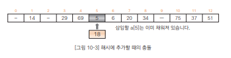
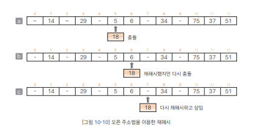

# Chapter10 해시 - 01 해시법
- 해시법은 검색뿐만 아니라 데이터의 주가와 삭제도 효율적으로 수행할 수 있는 방법

<br>

## 정렬된 배열에 새로운 값 추가


- 요소가 13개인 배열에서 앞쪽 10개 요소에 오름차순으로 정렬된 데이터가 저장되어 있다.
- 이 배열에 35를 추가하는 과정은 다음과 같다.
  > 1. 삽입할 위치가 a[5]와 a[6] 사이임을 이진 검색법으로 조사한다.
  > 2. 그림 [b]와 같이 a[6] 이후의 모든 요소를 하나씩 이동한다.
  > 3. a[6]에 35를 대입한다.
- 요소 이동에 필요한 복잡도(time-complexity)는 O(n)이므로 그 비용(cost)는 결코 작지 않다.
- 물론 데이터는 삭제하는 경우에도 똑같은 비용이 발생한다.

<br>

---

<br>

## 해시법
- 해시법(hashing)은 데이터를 저장할 위치(인덱스)를 간단한 연산으로 구하여 검색, 추가, 삭제를 효율적으로 수행
- 위 그림의 a에서 배열의 키값(각 요소의 값)을 배열의 요솟수 13으로 나눈 나머지를 정리하면 아래 표와 같다.

  

  - 이렇게 표에 정리한 값을 해시값(hash value)이라고 하며, 이 해시값은 데이터에 접근할 때 사용
- 해시갖ㅅ을 인덱스로 하여 원래의 키값을 저장한 배열이 해시 테이블(hash table)
- 위 표의 해시 테이블은 아래 그림의 [a]이다.

  

- 배열에 35를 추가하는 경우를 생각해 보겠다.
  - 35를 13으로 나눈 나머지는 9이므로 [b]처럼 a[9]에 값(35)을 저장한다.
  - 새로운 값을 추가하더라도 다른 배열 요소를 뒤로 옮기지 않아도 된다.
  - 이렇게 키값(35)을 해시값(9)으로 변환하는 과정을 해시 함수(hash function)라고 함
  - 해시 테이블의 각 요소를 버킷(bucket)이라고 함

<br>

---

<br>

## 충돌
- 이어서 배열에 새로운 값 13을 추가해 보겠다.
- 18을 13으로 나눈 나머지, 즉 18의 해시값은 5이고 저장할 곳은 버킷 a[5]이다.
- 그런데 아래 그림처럼 이 버킷은 이미 채워져 있다.
  
  

  - 이 경우에서 알 수 있듯이 키값과 해시값의 대응관계가 반드시 1 대 1이어야 하는 것은 아니다(보톤 n 대 1)
- 이렇게 저장할 버킷이 중복되는 현상을 충돌(collision)이라고 함
- 그러므로 해시 함수는 가능하면 해시값이 치우치지 않도록 고르게 분포된 값을 만들어야 함

<br>

### 충돌 대처법
- 충돌이 발생할 때 다음 2가지 방법으로 대처할 수 있다. 이 2가지 방법을 살펴보겠다.
  > - 체인법 : 해시법이 같은 요소를 연결리스트로 관리한다.
  > - 오픈 주소법 : 빈 버킷을 찾을 때까지 해시를 반복

<br>

---

<br>

## 체인법
- 체인법(chaining)은 해시값이 같은 데이터를 사슬(chain) 모양의 연결리스트로 연결하는 방법으로, 오픈 해시법(open hashing)이라고도 함

<br>

### 해시값이 같은 데이터 저장
- 아래 그림은 체인법으로 구현한 해시의 한 예이다.

  

  - 배열(해시 테이블)의 각 버킷에 저장하는 값은 그 인덱스를 해시 값으로 하는 연결 리스트의 첫 번째 노드에 대한 참조(배열 이름을 table로 지정)
  - 그림에서 69와 17의 해시값은 모두 4이고, 이들을 연결하는 연결 리스트의 첫 번째 노드에 대한 참조를 table[4]에 저장
  - 해시값(배열 인덱스) 0과 2처럼 데이터가 하나도 없는 버킷값은 null 참조로 함

<br>

### 버킷용 클래스 Node<K, V>
- 개별 버킷을 나타낸 것이 클래스 Node<K, V>
- 이 클래스에는 다음 3가지 필드가 있다.
  > - key ... 키값(자료형 K는 임의의 자료형)
  > - data ... 데이터(자료형 V는 임의의 자료형)
  > - next ... 체인에서 다음  노드에 대한 참조(자료형은 Node<K, V>)
- 제네릭 클래스인 Node<K, V>의 매개 변수 자료형은 키값의 자료형 K와 데이터의 자료형 V
- K와 V는 독립적인 참조이므로, 예를 들어 데이터가 '회원번호, 이름, 키, 몸무게'로 구성되어 있고 '회원번호'를 키(key)로 하여 나태내면 아래 그름 a와 b의 두 메서드를 모두 사용할 수 있다.
  
  

- 자기 참조형 클래스인 Node<K, V>의 이미지를 아래 그림에 나타냈다.
  
  

  - 필드 next에 대입되는 값은 체인에 있는 다음 노드에 대한 참조이다.
  - 하지만 다음 노드가 없으면 null이 대입된다.
  - Node<K, V>에는 3가지 메서드가 있다.
    > - getKey ... 키값(key)을 그대로 반환한다.
    > - getValue ... 데이터(data)를 그대로 반환한다.
    > - hashCode ... 키값(key)의 해시값을 반환한다.

<br>

### 해시클래스 ChainHash<K, V>의 필드
- 해시 클래스 ChainHash<K, V>에는 두 필드가 있다.
  > - size ... 해시 테이블의 용량(배열 table의 요솟수)
  > - table ... 해시 테이블을 저장하는 배열

<br>

### 생성자 ChainHash
- 클래스 ChainHash<K, V>의 생성자는 비어있는 해시 테이블을 생성하며, 매개변수 capacity에 전달받은 것은 해시 테이블의 용량이다.
- 요솟수가 capacity인 배열 table의 본체를 생성하고, capacity 값을 필드 size에 복사
- 생성자가 호출된 직후 table의 모든 요소는 null을 참조하며, 모든 버킷이 비어있는 상태가 된다.
- 그리고 메모리 확보에 실패하면(OutOfMemoryError) 필드 size에 0을 넣는다.

<br>

### 메서드 hashCode
- 해시값을 구하는 메서드
- key의 해시값을 size(해시테이블의 용량)로 나눈 나머지를 반환한다.

<br>

### 보충수업 10-1 해시와 해시 함수 알아보기
- 만약 충돌이 전혀 발생하지 않는다면 해시 함수로 인덱스를 구하는 것만으로 검색, 추가, 삭제가 거의 완료되므로 시간 복잡도는 O(1)이 됨
  - 해시 테이블을 크게 하면 충돌 발생을 억제할 수는 있지만 다른 한편으로 메모리를 쓸데없이 많이 차지하게 됨
  - 즉, 시간과 공간의 절충(trade-off)이라는 문제가 항상 따라다닌다.
- 충돌을 피하려면 해시 함수는 해시 테이블 용량 이하의 정수를 되도록이면 한쪽으로 치우치지 않도록 고르게 만들어야 한다.
  - 그래서 해시 테이블 용량을 소수가 좋다고 알려져 있다.
- 키 값이 정수가 아닐 경우 해시값을 구할 때 좀 더 신경을 써서 방법을 모색해야 한다.
  - 예컨데 실수 키값에 대해 비트 연산(bitwise operation)을 하는 방법, 문자열 키값에 대해 각 문자 코드에 곱셈과 덧셈을 하는 방법이 있다.

<br>

### 키 값으로 요소를 검색하는 search 메서드
- 키값이 key인 요소를 검색하는 메서드
- search 메서드가 요소를 어떻게 검색하는지 구체적으로 살펴보겠다.
  1. 그림 10-8 [a]에서 33을 검색하는 경우
  - 33의 해시값은 7이므로 table[7]이 가리키는 연결 리스트를 따라감
  - 22 -> 33으로 차례로 따라가면 성공
  2. 그림 10-8 [a]에서 26을 검색하는 경우
  - 26의 해시값은 0, table[0]이 null이므로 검색 실패
- 검색 과정을 정리하면 다음과 같다.
  > 1. 해시 함수로 키값을 해시값으로 변환한다.
  > 2. 해시값을 인덱스로 하는 버킷을 선택한다.
  > 3. 선택한 버킷의 연결 리스트를 처음부터 순서대로 선형 검색한다. 키값과 같은 값을 찾으면 검색 성공이다. 끝까지 스캔하여 찾지 못하면 검색 실패이다.

<br>

### 요소를 추가하는 메서드 add
- 키값이 key이고 데이터가 data인 요소를 삽입하는 메서드
  1. 그림 10-8 [a]에 13을 삽입하는 경우
  - 13의 해시값은 0이고 table[0]은 null
  - [b]와 같이 13을 저장하는 노드를 새로 만들고, 그 노드에 대한 참조를 table[0]에 대입
  2. 그림 10-8 [a]에 46을 삽입하는 경우
  - 46의 해시값은 7이고 table[7]의 버킷에는 20과 33을 연결한 리스트에 대한 참조가 저장되어 있다.
  - 이 리스트에는 추가할 값(46)이 존재하지 않으므로 리스트의 맨앞에 46을 삽입
    - 좀 더 자세히 설명하면 추가할 값(46)을 저장하는 노드를 새로 만들고 그 노드에 대한 참조를 table[7]에 대입
    - 그리고 삽입한 노드가 갖는 다음 노드에 대한 참조(next)가 20을 저장한 노드를 가리키도록 업데이트
- 요소를 삽입하는 과정을 정리하면 다음과 같다.
  > 1. 해시 함수가 키값을 해시값으로 변환한다.
  > 2. 해시값을 인덱스로 하는 버킷을 선택한다.
  > 3. 버킷이 가리키는 연결리스트를 처음부터 순서대로 검색한다. 키값과 같은 값을 찾으면 키 값이 이미 등록된 상태이므로 삽입에 실패한다. 끝까지 스캔하여 찾지 못하면 리스트의 맨 앞에 노드를 삽입한다.


<br>

### 요소를 삭제할 메서드 remove
- 키값이 key인 요소를 삭제하는 메서드
- 그림 10-9 [a]에서 69를 삭제하는 경우를 예로 들어 어떻게 삭제하는지 살펴보겠다.
  - 69의 해시값은 4이고, table[4]의 버킷에 저장된 참조의 리스트를 선형 검색하면 69를 찾을 수 있다.
  - 그런데 69를 저장한 노드의 다음 노드는 17을 저장한 노드
  - 그래서 [b]처럼 17을 저장한 노드에 대한 참조를 table[4]의 버킷에 대입하면 노드는 삭제된다.
- 요소를 삭제하는 과정을 정리하면 다음과 같다.
  > 1. 해시 함수로 키값을 해시값으로 변환한다.
  > 2. 해시값을 인덱스로 하는 버킷을 선택한다.
  > 3. 버킷이 가리키는 연결 리스트를 처음부터 순서대로 검색한다. 키값과 같은 값을 찾으면 그 노드를 리스트에서 삭제한다. 그렇지 않으면 삭제에 실패한다.


<br>

### 해시 테이블의 모든 내용을 출력하는 메서드 dump
- 해시 테이블의 내용을 통째로 출력하는 메서드
- 해시 테으블의 모든 요소(table[0] ~ table[size-1])에 대하여 다음에 오는 노드를 차례로 따라가면서 각 노드의 키값과 데이터를 출력하는 작업을 반복
- 이 메서드를 실행하면 해시값이 같은 버킷이 선형 리스트에서 사슬 모양으로 연결된 것을 확인할 수 있다.

<br>

### 보충수업 10-2 열거 살펴보기
- 실습 10-2 프로그램은 대화형 메뉴를 출력하고 선택하는 일을 수행, 이때 사용하는 것이 열거
- 다른 프로그래밍 언어에서는 정수를 확장한 것으로 구현하는 경우가 많은데 자바에서는 열거를 내부적으로 클래스로 구현하므로 매우 강력하고 기능도 다양하다.
- 예를 들어 계절을 나타내는 간단한 열거를 살펴보자
  ```java
  enum Season {
    SPRING, SUMMER, AUTUMN, WINTER
  };
  ```
  - 이 열거를 컴파일하고 나면 다음과 같이 된다(사용자가 이런 코드를 일일이 작성하기엔 너무 번거롭다)
  ```java
  final class Season extends Enum<Season> {
    public static final Season[] values() {
      return (Season[])$VALUES.clone();
    }
    public static Season valueOf(String s) {
      return (Season)Enum.valueOf(Season, s);
    }
    private Season(String s, int i) {
      super(s, i);
    }
    public static final Season SPRING;
    public static final Season SUMMER;
    public static final Season AUTUMN;
    public static final Season WINTER;
    private static final Season $VALUES [];
    static {
      SPRING = new Season("SPRING", 0);
      SUMMER = new Season("SUMMER", 1);
      AUTUMN = new Season("AUTUMN", 2);
      WINTER = new Season("WINTER", 3);
      $VALUES = (new Season[] {
        SPRING, SUMMER, AUTUMN, WINTER
      });
    }
  }
  ```
- 열거는 java.lang.Enum 클래스에서 파생한 서브 클래스로 컴파일되며, 다음과 같은 큭징이 있다.
  > - 각 열거 상수를 나타내는 서수(선언한 순서대로 할당하는 일련번호 0, 1, 2, ...)는 ordinal 메서드로 조사한다.
  > - 선언한 순서로 모든 열거형 값을 저장한 배열은 values 메서드로 얻을 수 있다.
  > - name 메서드와 toString 메서드 둘 다 name 필드의 값을 반환한다. 다만 name 메서드는 final 선언이 되어 오버라이드할 수 없는 반면에 toString 메서드는 오버라이드할 수 있다는 점이 다르다.
- 앞의 프로그램 코드에서 ordinal, name, toString 메서드가 없는 것은 슈퍼 클래스인 Enum 클래스에 정의된 메서드를 상속하기 때문
- 열거는 메서드나 필드를 자유롭게 추가하거나 인터페이스를 구현할 수 있으므로 확장성이 우수

<br>

---

<br>

## 오픈 주소법
- 또 다른 해시법인 오픈 주소법(open addressing)은 충돌이 발생했을 때 재해시(rehashing)를 수행하여 비어 있는 버킷을 찾아내는 방법으로, 닫힌 해시법(closed hashing)이라고도 함
- 요소의 검색, 삽입, 삭제 과정을 그림 10-10을 보면서 자세히 살펴보겠다.



<br>

### 요소 삽입
- 그림 10-10의 [a]는 새로운 값(18)을 삽입하고자 할 때 충돌이 발생한 경우, 이럴 때 사용하는 방법이 재해시이다.
- 재해시할 때 해시 메서드는 자유롭게 결정할 수 있다.
  - 여기서는 키값에 1을 더한 값을 13으로 나눈 나머지로 함
  - 이렇게 재해시를 하면 (18+1) % 13의 결과값 6을 얻을 수 있다.
- 그런데 [b]처럼 인덱스가 5인 버킷고 데이터가 이미 채워져 있으므로 다시 재해시한다.
  - 그러면 (19+1) % 13의 결과값 7을 얻을 수 있다.
- 따라서 [c]처럼 인덱스가 7인 버킷에 새로운 데이터(18)를 삽입함
- 이렇게 오픈 주소법은 빈 버킷을 만날 때까지 재해시를 여러 번 반복하므로 선형 탐사법(linear probing)이라고도 함

<br>

### 요소 삭제
- 이제 [c]에서 인덱스가 5인 값을 삭제하는 과정을 살펴보겠다.
- 인덱스가 5인 버킷의 데이터를 비우면 될 거 같지만 실제로는 그렇게 간단하지 않다.
- 인덱스가 5인 버킷을 그대로 비워두면 해시값이 같은 18을 검색할 때 '해시값이 5인 데이터는 존재하지 않는다'라고 생각하여 검색에 실패하기 때문
- 그래서 각 버킷에 다음 속성 중 하나를 부여
  > 1. 데이터 저장
  > 2. 비어 있음 속성값(-)
  > 3. 삭제 마침 속성값(★)


<br>

### 요소 검색
- 이 상태에서 값 17을 검색해 보겠다.
  - 해시값이 4인 버킷을 보면 속성값이 '비어있음(-)'이므로 검색 실패
- 이제 18을 검색하는 경우를 생각해 보겠다.
  - 해시값이 5인 버킷을 보면 그 속성은 '삭제 마침(★)'이다.
  - 그래서 그림 10-12처럼 재해시 수행하여 6인 버킷을 다시 검색
  - 여기서 값 6이 저장되어 있으므로 다시 재해시 수행하여 7인 버킷을 검색
  - 검색하는 값 18이 저장되어 있으므로 검색 성공


- OpenHash<K, V>
  - dump 메서드는 해시 테이블의 내용을 통째로 보여주는 메서드
  - 버킷 안에 데이터가 등록되어 있으면 키와 값을 표시하고, 그렇지 않으면 '비어 있음'이나 '삭제 마침'을 표시

<br>

---

<br>

정리한 내용에 대한 저작권은 "[do it! 자료구조와 함께 배우는 알고리즘 입문 자바편 개정](https://www.aladin.co.kr/search/wsearchresult.aspx?SearchTarget=All&SearchWord=Do+it%21+%EC%9E%90%EB%A3%8C%EA%B5%AC%EC%A1%B0%EC%99%80+%ED%95%A8%EA%BB%98+%EB%B0%B0%EC%9A%B0%EB%8A%94+%EC%95%8C%EA%B3%A0%EB%A6%AC%EC%A6%98+%EC%9E%85%EB%AC%B8+%3A+%EC%9E%90%EB%B0%94+%ED%8E%B8)"에 있습니다.